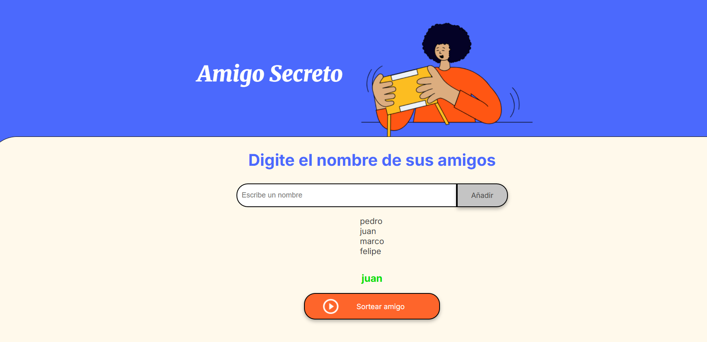

# challenge-amigo-secreto
repositorio del challenge del amigo secreto #aluraLATAM

Este proyecto es una pequeña aplicación web  que permite crear una lista de amigos y realizar un sorteo aleatorio para seleccionar a un "amigo secreto". Fue creado con el objetivo de **fortalecer habilidades de lógica de programación y manipulación del DOM en JavaScript puro**.

## Tareas

requirements:
 * validateName: not empty input
 * addName: insert the input into an array
 * visualizeList: autoUpdate
 * randomSorteo: sortearAmigo button, select a random friend from the list.

## 🧠 Objetivo

Desarrollar la lógica de un sistema que permita:
- Agregar nombres a una lista de amigos.
- Validar que no se ingresen entradas vacías.
- Evitar nombres duplicados en la lista.
- Visualizar automáticamente la lista en pantalla.
- Realizar un sorteo aleatorio entre los amigos ingresados.
- Mostrar el resultado del sorteo en pantalla.

## 📂 Estructura del proyecto

📁 amigo-secreto/
├── index.html # Estructura HTML principal

├── style.css # Estilos del proyecto (no incluido aquí)

├── app.js # Lógica principal en JavaScript

├── assets/ # Imágenes utilizadas en la interfaz

└── README.md # Este archivo

## 🚀 Cómo usarlo

1. Clona este repositorio o descarga los archivos.
2. Abre el archivo `index.html` en tu navegador.
3. Escribe nombres en el campo de entrada y haz clic en **"Añadir"**.
4. Cuando tengas varios amigos en la lista, haz clic en **"Sortear amigo"** para ver el resultado.

## 🛠️ Tecnologías utilizadas

- **HTML5**: para la estructura de la página.
- **CSS3**: para los estilos (no detallado aquí).
- **JavaScript (Vanilla)**: para la lógica del programa y la manipulación del DOM.

## 📌 Funciones principales (`app.js`)

| Función           | Descripción |
|------------------|-------------|
| `validateName(name)` | Verifica que el nombre no esté vacío. |
| `clearInput(id)` | Limpia el campo de entrada. |
| `isListEmpty()` | Verifica si la lista está vacía. |
| `updateList(name)` | Agrega el nombre a la lista y al DOM, si no está duplicado. |
| `agregarAmigo()` | Controlador principal para agregar un amigo. |
| `sortearAmigo()` | Selecciona un nombre aleatorio de la lista y lo muestra en el DOM. |

## ✅ Buenas prácticas aplicadas

- Uso de funciones pequeñas y reutilizables.
- Separación clara de responsabilidades.
- Validaciones básicas para mejorar la experiencia del usuario.

## 📷 Captura de pantalla

> 

## 💡 Posibles mejoras

- Permitir eliminar amigos de la lista.
- Mostrar todos los resultados del sorteo sin repetir.
- Añadir animaciones al sorteo.
- Guardar la lista en `localStorage`.

¡Gracias por visitar este repositorio! Si te gustó el proyecto, no dudes en compartirlo o adaptarlo a tus necesidades.
